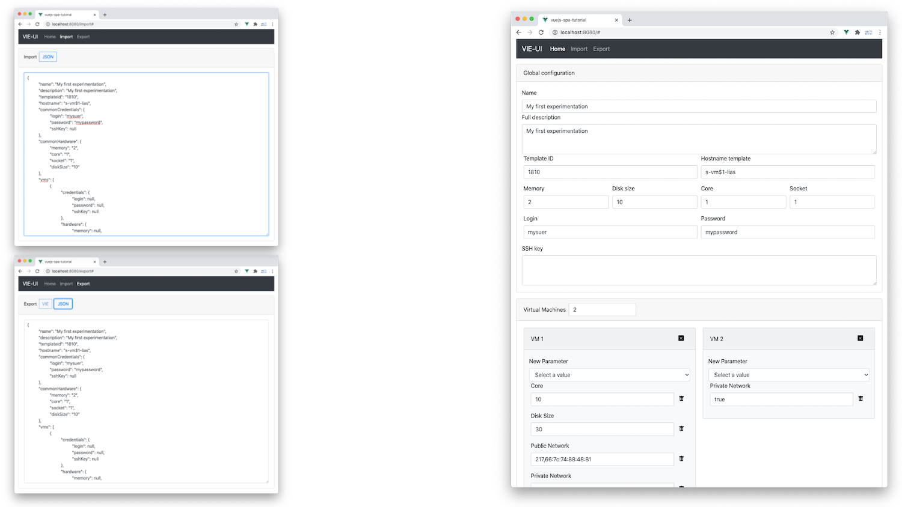

# Exercice 1 : savoir réaliser une conception à partir d'une maquette graphique

Ce premier exercice propose de réaliser une conception à partir d'une maquette composée d'interfaces graphiques sans possibilité d'interaction. Cette conception permettra d'identifier les composants à développer et choisir les techniques de communication entre ces mêmes composants. Une fois clairement spécifiée, ces composants seront développés dans la suite des exercices.

La maquette graphique a été développée préalablement en utilisant HTML et CSS via la bibliothèque CSS [Boostrap](https://getbootstrap.com/). Cette maquette est fournie dans le répertoire _htmldesign/_.

## But

* Identifier des composants à partir d'une maquette graphique.
* Choisir des techniques de communication entre composant (propriété, événement personnalisé ou gestionnaire d'état).

## Étapes à suivre

* Depuis le répertoire _htmldesign/_, ouvrir les différents fichiers HTML dans un navigateur web (_export.html_, _import.html_ et _index.html_). Pour rappel, les écrans correspondants ont été présentés ici : [README.md](../README.MD).

* Identifier les six composants portant les noms suivants : *MenuBar*, *Export*, *Import*, *Common*, *VirtualMachine* et *VirtualMachineElement*.



> Pour identifier les composants, vous pouvez examiner sur les interfaces graphiques des blocs qui se répètent ou qui ont un sens fonctionnel spécifique. Faites attention à ne pas proposer un découpage trop fin car cela impactera le nombre de composants et par conséquent le temps de développement s'en trouverait augmenté. La difficulté de ce type de conception est d'obtenir un bon compromis sur le nombre de composants.

* Définir un arbre de composants qui mettra en évidence les composants parents et les composants enfants. Le composant racine s'appellera *App*. Vous donnerez également la cardinalité au niveau de la relation composant parent et composant enfant (`1`, `0..n` ou `1..n`).

La communication entre tous les composants sera réalisée principalement par un gestionnaire d'état (un modèle qui partage les données). Nous donnons ci-dessous, la description de ce gestionnaire d'état via un code JavaScript (le code fait office de modèle *Code First*).

```javascript
class HardwareSpecification {
    constructor() {
        this.memory = null;
        this.core = null;
        this.socket = null;
        this.diskSize = null;
    }
}

class Credentials {
    constructor() {
        this.login = null;
        this.password = null;
        this.sshKey = null;
    }
}

class Network {
    constructor() {
        this.publicNet = null;
        this.privateNet = null;
    }
}

const MAX_VM = 20
const MIN_VM = 1

export const store = {
    debug: true,
    state: {
        name: '',
        description: '',
        templateId: '',
        hostname: '',
        commonCredentials: new Credentials(),
        commonHardware: new HardwareSpecification(),
        vms: [{ credentials: new Credentials(), hardware: new HardwareSpecification(), network: new Network() }],
        vmsLength: 1
    },
    ... // Modifieurs et accesseurs
}
```

Vous remarquerez les classes qui décrivent les caractéristiques d'une machine virtuelle : `HardwareSpecification`, `Credentials` et `Network`. Nous avons regroupé ces caractéristiques dans des classes puisqu'elles sont utilisées à plusieurs endroits, soit globalement pour toutes les machines virtuelles (composant *Common*) ou soit dans chaque machine virtuelle (composant *VirtualMachine*). La propriété `state` contient toutes les propriétés suffisantes pour stocker les informations de l'application **VIE-UI**. Ainsi, les modifications sur les interfaces graphiques des composants impacteront les valeurs des propriétés de `store`. Par exemple, quand l'utilisateur modifiera le nom de son expérimentation, la propriété `name` sera modifiée.

> Pour la mise en place du gestionnaire d'état, nous avons suivi les préconisations proposées [ici](https://vuejs.org/v2/guide/state-management.html). Nous n'utiliserons pas de bibliothèque spécifique telle que [Vuex](https://vuex.vuejs.org/). L'idée étant de maîtriser ce patron de conception avant l'utilisation d'implémentation prête à l'emploi. Nous reviendrons dans les prochains exercices sur la mise en place d'un gestionnaire d'état *Do It Yourself*.

En plus de la communication par gestionnaire d'état, les composants *VirtualMachine* et *VirtualMachineElement* utiliseront la communication par propriétés (*Props*). Cette communication servira à associer une instance d'un composant par rapport au contenu fourni par le gestionnaire d'état. Par exemple, la description d'une machine virtuelle est détaillée dans le composant *VirtualMachine*. L'index du tableau `vms` sera utilisé pour identifier une instance du composant *VirtualMachine*. Ce type de communication nécessite de déclarer des propriétés au niveau du composant enfant (ici *VirtualMachine* et *VirtualMachineElement*). Pour chaque propriété, il faudra préciser un nom, un type et le caractère obligatoire de la propriété. Concrètement dans notre exemple, le composant *VirtualMachine* devra déclarer une propriété obligatoire nommée `currentIndex` et de type `Number`. Le composant parent *Common* devra transmettre pour les création des instances du composant *VirtualMachine*, un nombre pour la propriété `currentIndex`.

* Pour le composant *VirtualMachineElement*, définir le contenu nécessaire pour réaliser la communication par propriétés. Vous préciserez notamment pour chaque propriété leur nom, leur type et leur caractère obligatoire.

> ASTUCE : trois propriétés devront être définies.