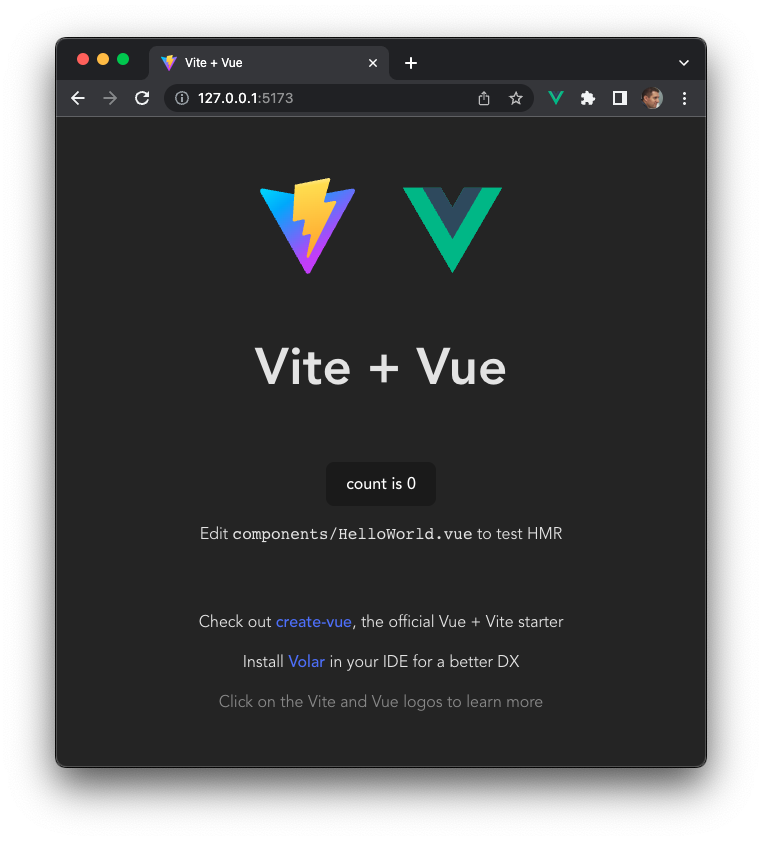

# Exercice 2 : savoir créer un projet et configurer son environnement de développement

Ce deuxième exercice propose de construire un projet [Vue.js](https://vuejs.org/) à partir de l'outil [Vite](https://vitejs.dev/) et de configurer son environnement de développement afin d'utiliser un *linter* ([ESLint](https://eslint.org/)), un formateur de code ([Prettier](https://prettier.io/)) et un éditeur de code ([Visual Studio Code](https://code.visualstudio.com/)).

## But

* Construire un projet [Vue.js](https://vuejs.org/) à partir de [Vite](https://vitejs.dev/).
* Configurer des outils d'analyse statique (Linter) et de formattage de code.
* Configurer l'environnement de développement [Visual Studio Code](https://code.visualstudio.com/).
* Compiler et exécuter une application web [Vue.js](https://vuejs.org/).

## Étapes à suivre

* Ouvrir un terminal, se positionner à la racine du dossier _vuejs-spa-tutorial-exercice2_ et saisir la ligne de commande ci-dessous pour créer le projet [Vue.js](https://vuejs.org/) _vie-app_ à partir de l'outil [Vite](https://vitejs.dev/). Une série de questions vous sera posée, nous donnerons les réponses au fur et à mesure.

```console
$ npm create vite@latest vie-app
```

* Sélectionner *Vue*. Vous remarquerez que [Vite](https://vitejs.dev/) n'est pas uniquement réservé à [Vue.js](https://vuejs.org/).

```console
? Select a framework: › - Use arrow-keys. Return to submit.
    Vanilla
❯   Vue
    React
    Preact
    Lit
    Svelte
    Others
````

* Sélectionner ensuite la première option *JavaScript* qui permet le développement avec ce langage. La deuxième option permet d’utiliser le langage TypeScript.

```console
? Select a variant: › - Use arrow-keys. Return to submit.
❯   JavaScript
    TypeScript
    Customize with create-vue ↗
    Nuxt ↗
```

* La création de votre projet [Vue.js](https://vuejs.org/) à partir du langage JavaScript est terminée.

```console
✔ Select a framework: › Vue
✔ Select a variant: › JavaScript

Scaffolding project in /Users/baronm/workspacepersowebsite/vuejs-spa-tutorial/vie-app...

Done. Now run:

  cd vie-app
  npm install
  npm run dev
```

* Installer toutes les dépendances nécessaires en exécutant la ligne de commande suivante :

```console
$ cd vie-app
$ npm install

added 33 packages, and audited 34 packages in 9s

4 packages are looking for funding
  run `npm fund` for details

found 0 vulnerabilities
```

Nous proposons dans la suite d'installer le *linter* [ESLint](https://eslint.org/) (outil de fond qui réalise une analyse statique du code source pour trouver des incohérences ou des anomalies) et le formateur de code [Prettier](https://prettier.io/) (outil de forme qui applique des règles de formatage : indentation, nombre de caractères maximum, etc.). Cette étape n'est pas obligatoire, mais recommandé pour fournir un code de qualité.

* Toujours dans le dossier _vie-app_, saisir la ligne de commande ci-dessous pour installer l'outil [Prettier](https://prettier.io/).

```console
$ npm install --save-dev --save-exact prettier

added 34 packages, and audited 35 packages in 8s

5 packages are looking for funding
  run `npm fund` for details

found 0 vulnerabilities
```

* Créer le fichier *.prettierrc* à la racine du dossier _vie-app_ puis saisir le contenu suivant.

```json
{
  "singleQuote": true,
  "semi": false,
  "trailingComma": "none"
}
```

* Installer l'outil [ESLint](https://eslint.org/) pour la version [Vue.js](https://vuejs.org/).

```console
$ npm install --save-dev eslint eslint-plugin-vue

added 109 packages, and audited 144 packages in 4s

31 packages are looking for funding
  run `npm fund` for details

found 0 vulnerabilities
```

* Créer le fichier *.eslintrc.cjs* à la racine du dossier _vie-app_ puis saisir le contenu suivant.

```JavaScript
module.exports = {
    env: {
      node: true,
    },
    extends: [
      'eslint:recommended',
      'plugin:vue/vue3-recommended',
      "prettier"
    ],
    rules: {
      // override/add rules settings here, such as:
      // 'vue/no-unused-vars': 'error'
    }
  }
```

* Exécuter la commande suivante pour désactiver les règles de formattage de [ESLint](https://eslint.org/) afin de les déléguer à [Prettier](https://prettier.io/).

```console
$ npm install eslint-config-prettier --save-dev

added 1 package, and audited 145 packages in 919ms

31 packages are looking for funding
  run `npm fund` for details

found 0 vulnerabilities
```

* Éditer le fichier *package.json* afin d'ajouter deux scripts (`lint` et `format`) permettant de lancer les outils [ESLint](https://eslint.org/) et [Prettier](https://prettier.io/) depuis la ligne de commande.

```json
{
  "name": "vie-app",
  "private": true,
  "version": "0.0.0",
  "type": "module",
  "scripts": {
    "dev": "vite",
    "build": "vite build",
    "preview": "vite preview",
    "lint": "eslint --ext .js,.vue --ignore-path .gitignore --fix src",
    "format": "prettier .  --write"
  },
  "dependencies": {
    "vue": "^3.2.41"
  },
  "devDependencies": {
    "@vitejs/plugin-vue": "^3.2.0",
    "eslint": "^8.28.0",
    "eslint-config-prettier": "^8.5.0",
    "eslint-plugin-vue": "^9.8.0",
    "prettier": "2.8.0",
    "vite": "^3.2.3"
  }
}
```

* Depuis l'invite de commande, tester le premier script `lint`.

```console
$ npm run lint

> vie-app@0.0.0 lint
> eslint --ext .js,.vue --ignore-path .gitignore --fix src


/Users/baronm/workspacepersowebsite/vuejs-spa-tutorial/vuejs-spa-tutorial-exercice2/vie-app/src/components/HelloWorld.vue
  5:3  warning  Prop 'msg' requires default value to be set  vue/require-default-prop

✖ 1 problem (0 errors, 1 warning)
```

On remarque lors de l'exécution de [ESLint](https://eslint.org/) qu'une erreur a été identifiée. Le `linter` reproche au code existant l'absence d'initialisation pour la Prop `msg` du fichier `HelloWorld.vue`.

* Depuis l'invite de commande, tester le second script `format`.

```console
$ npm run format

> vie-app@0.0.0 format
> prettier .  --write

.eslintrc.cjs 49ms
.prettierrc 29ms
.vscode/extensions.json 3ms
index.html 40ms
package-lock.json 113ms
package.json 15ms
README.md 43ms
src/App.vue 50ms
src/components/HelloWorld.vue 23ms
src/main.js 4ms
src/style.css 20ms
vite.config.js 7ms
```

Tous les fichiers du répertoire _vie-app_ sont formattés selon le format du fichier (*.vue*, *.js*, *.json*, etc.).

L'exécution des scripts `lint` et `format` est utile principalement pour l'intégration continue, mais dans le cadre de cette série d'exercices nous avons besoin d'utiliser l'éditeur de code [Visual Studio Code](https://code.visualstudio.com/). Pour le développement de projet [Vue.js](https://vuejs.org/), nous aurons besoin d'installer les plugins [Volar](https://github.com/johnsoncodehk/volar), [ESLint](https://github.com/Microsoft/vscode-eslint) et [Prettier](https://github.com/prettier/prettier-vscode).

* Depuis l'invite de commande et en se positionnant à la racine du dossier _vie-app_, démarrer [Visual Studio Code](https://code.visualstudio.com/) via la commande suivante.

```console
$ code .
```

> Si la commande *code* ne fonctionne pas, démarrer [Visual Studio Code](https://code.visualstudio.com/) par son raccourci et ouvrir le dossier _vie-app_ depuis le menu *Fichier* (*Fichier -> Ouvrir le dossier...*). 

* Installer les plugins [Volar](https://github.com/johnsoncodehk/volar), [ESLint](https://github.com/Microsoft/vscode-eslint) et [Prettier](https://github.com/prettier/prettier-vscode) depuis le menu Extensions.

* Configurer les paramètres utilisateurs stockées dans le fichier *settings.json* et ajouter les éléments suivants.

```json
  ...
  "[vue]": {
    "editor.formatOnSave": true,
    "editor.defaultFormatter": "esbenp.prettier-vscode"
  }
}
```

Les paramètres ajoutés précisent que le formattage de code sera réalisé à chaque sauvegarde et utilisera le formatteur [Prettier](https://prettier.io/).

L'environnement de développement est désormais complet, nous allons pouvoir examiner le contenu généré par [Vite](https://vitejs.dev/).

* Les fichiers générés correspondent à une application minimaliste *HelloWorld*. Examiner les fichiers générés dans le répertoire _vie-app_.

```console
vie-app
├── README.md
├── index.html
├── node_modules\...
├── package-lock.json
├── package.json
├── public
│   └── vite.svg
├── src
│   ├── App.vue
│   ├── assets
│   │   └── vue.svg
│   ├── components
│   │   └── HelloWorld.vue
│   ├── main.js
│   └── style.css
└── vite.config.js
```

Le fichier _README.md_ donne une description de la manière dont le contenu a été généré.

Le fichier _index.html_ est le point d’entrée de votre application. Tout le code que vous allez développer sera injecté dans `<div id="app"></div>`. Vous ne devriez pas directement modifier ce fichier.

Le fichier _package.json_ est le fichier de configuration de votre projet. Ce fichier de configuration contient de métadonnées pour décrire le projet : `name` et `version`. Il contient également les dépendances vers les bibliothèques utilisées par le projet.

Le répertoire _node_modules_ contient l’ensemble des modules nécessaires pour la construction du projet. Ce répertoire est obtenu automatiquement en exécutant le script `$ npm install`. L’outil **npm** se base alors sur le fichier _package.json_ pour télécharger les modules directs et transitifs. Par comparaison, c’est très ressemblant à Maven de l’univers Java où _pom.xml_ correspond au fichier _package.json_.

Le répertoire _public_ est utilisé pour stocker les ressources statiques (des images par exemple) qui se situent au niveau de _index.html_.

Le fichier *src/App.vue* est le premier composant de votre application qui va contenir tous les autres composants. Il est en quelque sorte le composant racine d’une application de type Single-Page application (SPA).

Le fichier *src/main.js* sert à configurer notre projet en permettant d'initialiser des variables globales et de préciser où le rendu doit être effectué (`createApp(App).mount('#app')`).

Le répertoire _src/assets_ contient les ressources qui se situent au niveau des composants.

Le répertoire _src/components_ contient tous les composants que vous allez développer. Tous les fichiers porteront l’extension _*.vue_. Actuellement, seul un composant est disponible appelé *HelloWorld*.

* Toujours depuis le terminal, saisir la commande suivante pour tester l'application *HelloWorld*.

```console
$ npm run dev

  VITE v3.2.4  ready in 384 ms

  ➜  Local:   http://127.0.0.1:5173/
  ➜  Network: use --host to expose
```

* Ouvrir un navigateur web à l'adresse http://127.0.0.1:5173/ pour visualiser le résultat de l'exécution.



Avant de démarrer le développement, nous allons supprimer tout le code inutile généré par l'outil [Vite](https://vitejs.dev/) (composant *HelloWorld*).

* Stopper l'exécution.

* Supprimer le fichier _src/components/HelloWorld.vue_, le fichier _src/style.css_, les ressources statiques _public/vite.svg_ et _src/assets/vue.svg_ 

* Remplacer le contenu du fichier _src/App.vue_ par le code ci-dessous.

```html
<script setup>
</script>

<template>
    <div class="container-fluid">
    </div>
</template>
```

* Remplacer le contenu du fichier _src/main.js_ par le code ci-dessous.

```html
import { createApp } from 'vue'
import App from './App.vue'

createApp(App).mount('#app')
```

Le contenu des fichiers et répertoires devrait ressembler à celui présenté ci-dessous.

```console
vie-app
├── README.md
├── index.html
├── node_modules\
├── package-lock.json
├── package.json
├── public\
├── src
│   ├── App.vue
│   ├── assets\
│   ├── components\
│   └── main.js
└── vite.config.js
```
