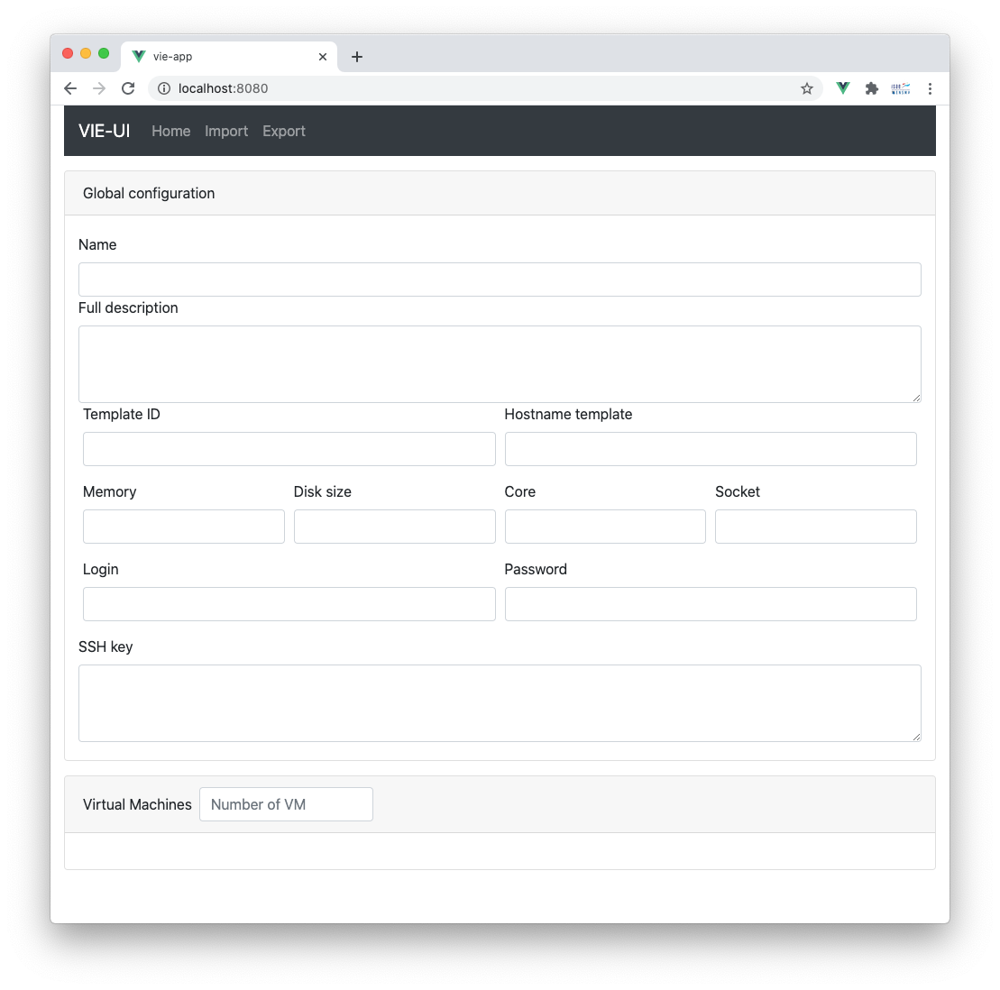

# Exercice 3 : savoir instancier les composants 

Dans l'exercice précédent, nous avons créé des fichiers *.vue* pour le développement de tous les composants et nous nous sommes limités à la partie graphique sans s'intéresser aux comportements dynamiques. Par ailleurs, tous les composants sont indépendants. Ce troisième exercice 
propose d'apprendre à instancier des composants en utilisant des balises personnalisées afin de construire une structure hiérarchique conforme à l'interface graphique de l'application **Vie-UI**.

La solution de l'exercice 2 est disponible dans le répertoire _vuejs-spa-tutorial-exercice3/vie-app_.

## But

* Savoir importer des composants.
* Savoir instancer des composants.

## Étapes à suivre

Nous allons commencer par le composant racine défini par le fichier _App.vue_. C'est le composant parent des composants *MenuBar*, *Import*, *Common* ou *Export*. Pour les trois derniers composants, le choix sera fait en fonction du routage choisi (traité dans le dernier exercice). Pour simplifier, nous utiliserons directement les composant *MenuBar* et *Common*.

* Éditer le fichier _App.vue_ et compléter par le code ci-dessous.

```html
<template>
  <div class="container-fluid" id="app">
    <menuBar />
  </div>
</template>

<script>
import menuBar from "@/components/MenuBar.vue";

export default {
  name: "App",
  components: { menuBar },
};
</script>

<style>
</style>
```

Le fichier _MenuBar.vue_ qui décrit le composant *MenuBar* est importé dans le composant racine par cette instruction `import menuBar from "@/components/MenuBar.vue"`. Il est associé à la balise personnalisée `<menuBar>` et utilisable dans le code du composant racine par cette instruction `components: { menuBar }`. Par conséquent, il est possible d'utiliser cette balise personnalisée dans la partie `<template>`.

* Compléter le fichier _App.vue_ qui décrit le composant racine afin d'ajouter le composant *Common*.

* Tester l'application via la ligne de commande `$ npm run serve`. Vous devriez obtenir le résultat suivant.



Nous allons maintenant instancier les composants *VirtualMachine* et *VirtualMachineElement* qui sont respectivement utilisés dans le composant *Common* et *VirtualMachine*.

* Éditer le fichier _src/components/Common.vue_ en déclarant le composant *VirtualMachine*.

```html
<script>
import VirtualMachine from "@/components/VirtualMachine.vue";

export default {
  name: "Common",
  components: {
    VirtualMachine,
  }
};
</script>
```

Pour l'utilisation de la balise personnalisée `VirtualMachine`, nous allons contourner le cahier des charges définis préalablement. En effet, comme nous ne pouvons pas encore utiliser le gestionnaire d'état, nous allons nous appuyer sur une propriété du composant *Common* `vmsLengthTemp` qui stockera le nombre d'instance du composant *VirtualMachine*. Ce besoin est décrit dans le code ci-dessous du fichier *common.vue*. **Dans la suite des exercices ce code sera supprimé.**

```html
<script>
import VirtualMachine from "@/components/VirtualMachine.vue";

export default {
  name: "Common",
  components: {
    VirtualMachine,
  },
  data() {
    return {
      vmsLengthTemp: 1,
    };
  },
};
</script>
```

* Dans la partie `<template>` du fichier _common.vue_, identifier la zone relative aux machines virtuelles (`<label for="inputNumberOfVM">Virtual Machines</label>`) puis compléter par les directives [Vue.js](https://vuejs.org/) présentes dans le code suivant.

```html
    ...
    <div class="card mt-3">
      <div class="card-header">
        <div class="form-inline">
          <div class="form-group">
            <label for="inputNumberOfVM">Virtual Machines</label>
          </div>
          <div class="form-group mx-2">
            <input type="text" class="form-control" id="inputNumberOfVM" v-model.number.lazy="vmsLengthTemp" placeholder="Number of VM" />
          </div>
        </div>
      </div>
      <div class="card-body">
        <div class="card-columns">
          <div v-for="index in vmsLengthTemp" :key="index">
            <VirtualMachine />
          </div>
        </div>
      </div>
    </div>
  </div>
</template>
```

Le code précédent définit une liaison bidirectionnelle entre la balise `<input>` et la propriété `vmsLengthTemp` par l'intermédiaire de la directive `v-model`. Plus précisément, le résultat sera transformé en nombre `v-model.number` et la valeur saisie sera envoyée à la propriété `vmsLengthTemp` dés que le focus sur le composant `<input>` sera perdu `v-model.number.lazy`.

Par ailleurs, la directive `v-for` est utilisée pour construire un nombre `vmsLengthTemp` d'instances de composant *VirtualMachine*.

## Avez-vous bien compris, valider vos compétences ? 

* Déclarer dans le composant *VirtualMachine* le composant *VirtualMachineElement*.

* Construire une seule instance du composant *VirtualMachineElement* à partir de la balise personnalisée `<VirtualMachineElement/>` et tester pour obtenir le résultat ci-dessous.

