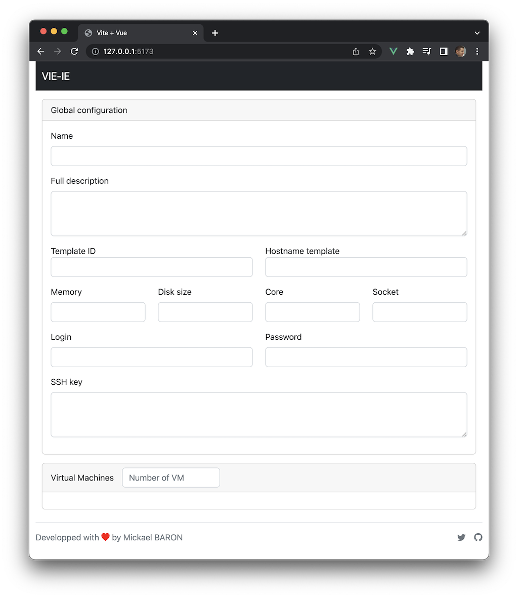
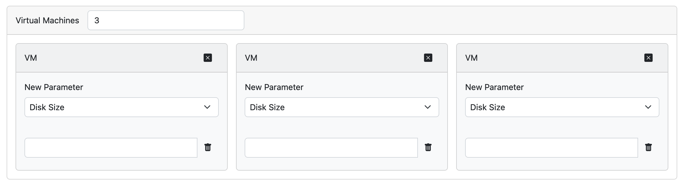

# Exercice 4 : savoir instancier les composants 

Dans l'exercice précédent, nous avons créé des fichiers *.vue* pour le développement de tous les composants et nous nous sommes limités à la partie graphique sans s'intéresser aux comportements dynamiques. Par ailleurs, tous les composants sont indépendants. Ce troisième exercice propose d'apprendre à instancier des composants en utilisant des balises personnalisées afin de construire une structure hiérarchique conforme à l'interface graphique de l'application **Vie-UI**.

## But

* Savoir importer des composants [Vue.js](https://vuejs.org/).
* Savoir instancer des composants.

## Étapes à suivre

Nous allons commencer par le composant racine *App* défini par le fichier _App.vue_. C'est le composant parent des composants *MenuBar*, *Global*, *Import*, *Export* ou *Footer*. Pour les composants *Global*, *Import* et *Export* le choix sera fait en fonction du routage choisi (traité dans le dernier exercice). En attendant d'étudier le routage, seul le composant *Global* sera affiché. Par conséquent, le composant racine *App* utilisera les composants *MenuBar*, *Global* et *Footer*.

* Éditer le fichier _App.vue_ et compléter par le code ci-dessous qui permet d'instancier les trois composants *MenuBar*, *Global* et *Footer*.

```html
<script setup>
import MenuBar from './components/MenuBar.vue'
import Global from './components/Global.vue'
import Footer from './components/Footer.vue'
</script>

<template>
  <div class="container-fluid">
    <MenuBar />
    <Global />
    <Footer />
  </div>
</template>

<style>
@import 'https://cdn.jsdelivr.net/npm/bootstrap@5.2.2/dist/css/bootstrap.min.css';
@import 'https://cdn.jsdelivr.net/npm/bootstrap-icons@1.9.1/font/bootstrap-icons.css';
</style>
```

Le fichier _MenuBar.vue_ qui décrit le composant *MenuBar* est importé dans le composant racine par cette instruction `import MenuBar from "./components/MenuBar.vue"`. Il est associé à la balise personnalisée `<MenuBar>` et il est donc possible de l'utiliser dans la partie `<template>`.

* Tester l'application via la ligne de commande `$ npm run dev`. Vous devriez obtenir le résultat suivant.



Nous allons maintenant instancier les composants *VirtualMachine* et *VirtualMachineElement* qui sont respectivement utilisés dans le composant *Global* et *VirtualMachine*.

* Éditer le fichier _src/components/Global.vue_ en déclarant le composant *VirtualMachine*.

```html
<script setup>
import VirtualMachine from './VirtualMachine.vue'
</script>

<template>
  ...
</template>
```

Pour l'utilisation de la balise personnalisée `VirtualMachine`, nous allons contourner le cahier des charges définis préalablement. En effet, comme nous ne pouvons pas encore utiliser le gestionnaire d'état, nous allons nous appuyer sur une propriété du composant *Global* `vmsLengthTemp` qui stockera le nombre d'instance du composant *VirtualMachine*. Ce besoin est décrit dans le code ci-dessous du fichier *Global.vue*. **Dans la suite des exercices ce code sera supprimé.**

* Éditer le fichier _src/components/Global.vue_ en déclarant la propriété `vmsLengthTemp`.

```html
<script setup>
import { ref } from 'vue'

import VirtualMachine from './VirtualMachine.vue'

const vmsLengthTemp = ref('1')
</script>

<template>
  ...
</template>
```

* Dans la partie `<template>` du fichier _Global.vue_, identifier la zone relative aux machines virtuelles (`<label for="inputNumberOfVM">Virtual Machines</label>`) puis compléter par les directives [Vue.js](https://vuejs.org/) présentes dans le code suivant.

```html
    ...
    <div class="container-fluid">
      <div class="card mt-3">
        <div class="card-header">
          <div class="row g-3 align-items-center">
            <div class="col-auto">
              <label for="inputNumberOfVM">Virtual Machines</label>
            </div>
            <div class="col-md-3">
              <input
                id="inputNumberOfVM"
                v-model.number.lazy="vmsLengthTemp"
                type="text"
                class="form-control"
                placeholder="Number of VM"
              />
            </div>
          </div>
        </div>
        <div class="card-body">
          <div class="row row-cols-1 row-cols-sm-2 row-cols-md-3 g-3">
            <!-- VirtualMachine component -->
            <div v-for="index in vmsLengthTemp" :key="index">
              <VirtualMachine />
            </div>
          </div>
        </div>
      </div>
    </div>
  </main>
</template>
```

Le code précédent `v-model.number.lazy="vmsLengthTemp"` définit une liaison bidirectionnelle entre la balise `<input>` et la propriété `vmsLengthTemp` par l'intermédiaire de la directive `v-model`. Plus précisément, le résultat sera transformé en nombre (`.number`) et la valeur saisie sera envoyée à la propriété `vmsLengthTemp` quand le focus sur le composant `<input>` sera perdu (`.lazy`).

Par ailleurs, la directive `v-for` est utilisée pour construire un nombre `vmsLengthTemp` d'instances de composant *VirtualMachine*.

* Tester l'application en vous assurant la création de plusieurs instances du composant *VirtualMachine* quand vous changez la valeur de la propriété `vmsLengthTemp`.

## Avez-vous bien compris, valider vos compétences ? 

* Déclarer dans le composant *VirtualMachine* le composant *VirtualMachineElement*.

* Construire une seule instance du composant *VirtualMachineElement* à partir de la balise personnalisée `<VirtualMachineElement/>` et tester pour obtenir le résultat ci-dessous.

